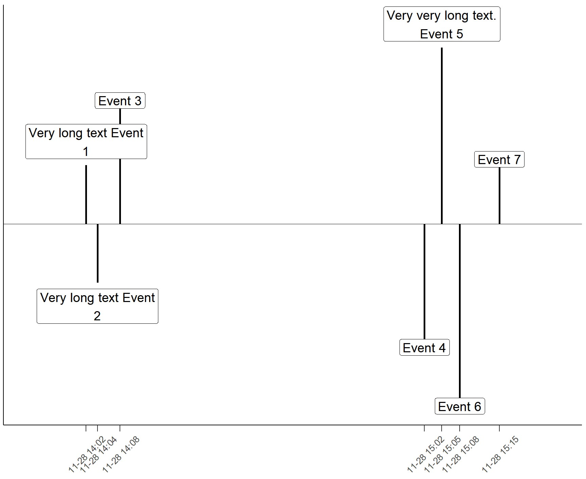

# Timeline
Techniques for producing a timeline chart that actually represents time along the y axis properly. The goal is to solve the fact that all the other approaches I found end up with inconsistent time spacing along the x axis, so they misrepresent the relative timing between the events. For example, you can see below that we have a widly varying delta of minutes between each item.

## Variants
1. Streamline R-variant integrated into PowerBI as an R-based visual

2. Original R-variant (based on code from https://benalexkeen.com/creating-a-timeline-graphic-using-r-and-ggplot2/ with full credit to that author)

3. PowerBI variant (using QueryOn custom visual)

